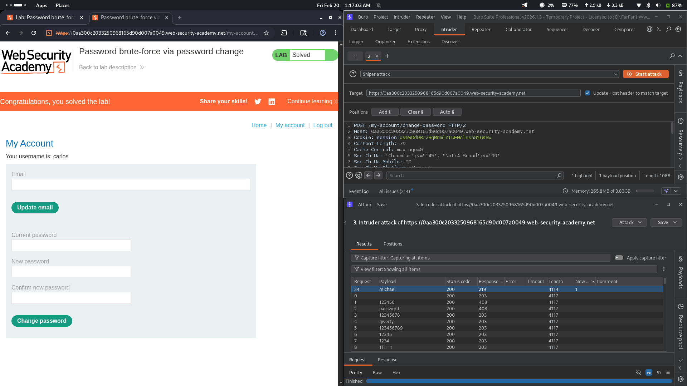

# Lab 12: Password Brute-Force via Password Change

## Category
Authentication (Password Brute-Force via Password Change)

## Vulnerability Summary
The application's password change functionality contains a critical logic flaw that allows attackers to brute-force user passwords. The system responds differently based on whether the "current password" field is correct, creating an information disclosure vulnerability. When an incorrect current password is submitted, the user is redirected to the login page. However, when the correct current password is provided (even with mismatched new passwords), the application displays a "New passwords do not match" error message. This behavioral difference creates a brute-force oracle.

## Attack Methodology
1. **Initial Access:** Logged in with legitimate credentials (`wiener:peter`) to access the password change functionality.
2. **Request Interception:** Captured the password change POST request using Burp Suite Proxy.
3. **Target Modification:** Changed the `username` parameter from `wiener` to the target user `carlos`.
4. **Payload Configuration:** Set `new-password-1` and `new-password-2` to different values to trigger the success indicator error message.
5. **Intruder Setup:** Configured Burp Intruder in Sniper mode with the `current-password` field as the payload position.
6. **Password List Attack:** Loaded the candidate password list and executed the brute-force attack.
7. **Response Analysis:** Identified the correct password by looking for responses containing "New passwords do not match" error (longer response length) instead of the redirect response.
8. **Account Compromise:** Used the discovered password to login as `carlos` and complete the lab.

## Technical Root Cause
The application has multiple critical security failures in its password change mechanism:
- **Inconsistent Error Handling:** The server responds differently based on whether the current password is correct, creating an information oracle. A secure implementation would return identical responses for all failure cases.
- **No Rate Limiting:** The password change endpoint lacks any brute-force protection, allowing unlimited attempts without account lockout or IP blocking.
- **Missing Authentication Validation:** The server processes password change requests for arbitrary usernames without verifying that the requesting user has permission to change that account's password.
- **Information Leakage:** Error messages reveal whether the current password guess was correct, enabling automated brute-force attacks.

## Impact
The user account of `carlos` has been completely compromised through brute-force attack. An attacker can:
- Systematically discover any user's password through automated brute-forcing
- Gain full unauthorized access to victim accounts
- Perform account takeover without triggering security alerts
- Exploit the lack of rate limiting to attack multiple user accounts
- Leverage the information disclosure to confirm password guesses with high confidence
