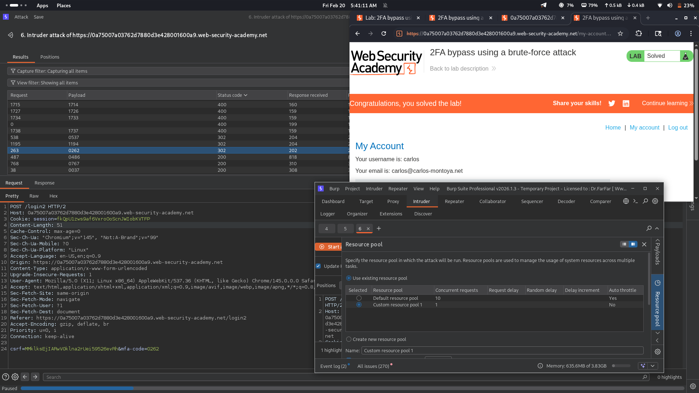

# Lab 14: 2FA Bypass Using Brute-Force Attack

## Category
Authentication (2FA Bypass via Brute-Force)

## Vulnerability Summary
The application implements two-factor authentication (2FA) with a security mechanism that temporarily blocks or logs out the user after submitting two incorrect MFA codes. However, this protection contains a critical logic flaw: the rate-limiting counter is not properly persisted across different sessions. An attacker can bypass this restriction by simply re-authenticating and starting a fresh session each time the limit is reached, allowing continuous brute-force attempts against the 6-digit MFA code without permanent account lockout.

## Attack Methodology
1. **Initial Access:** Obtained valid credentials for the target user (e.g., `carlos`) through prior reconnaissance or credential stuffing.
2. **Login Attempt:** Submitted the correct username and password to reach the 2FA verification page.
3. **Request Interception:** Captured the MFA verification POST request using Burp Suite Proxy.
4. **Intruder Configuration:** Set up Burp Intruder in Sniper mode with the MFA code field as the payload position.
5. **Payload Setup:** Configured a number generator from `000000` to `999999` to cover all possible 6-digit combinations.
6. **Session Cycling:** When the application blocked after 2-3 failed attempts, re-authenticated with the same credentials to obtain a fresh session.
7. **Continuous Attack:** Resumed the brute-force attack from the new session, repeating the login cycle as needed.
8. **Code Discovery:** Identified the correct MFA code when the server responded with a successful authentication redirect.
9. **Account Takeover:** Used the discovered MFA code to complete the 2FA process and gain full administrative access.

## Technical Root Cause
The application has multiple critical security failures in its 2FA implementation:
- **Session-Based Rate Limiting:** The MFA attempt counter is stored in the session state rather than server-side with persistent tracking, allowing reset through re-authentication.
- **Missing Persistent Lockout:** Failed MFA attempts are not tracked across sessions, enabling attackers to circumvent lockout mechanisms by simply logging in again.
- **No IP-Based Throttling:** The server does not implement IP-based rate limiting for MFA attempts, allowing the same attacker to continue from the same source.
- **Insufficient Session Binding:** The 2FA verification does not maintain a secure link between the initial authentication and subsequent MFA attempts across session renewals.
- **Weak MFA Code Space:** A 6-digit numeric code provides only 1 million combinations, which is brute-forceable with session cycling.
- **Missing Anomaly Detection:** The system does not detect or flag suspicious patterns such as repeated logins followed by MFA failures.

## Impact
The administrator account `carlos` has been completely compromised through a session-cycling brute-force attack. An attacker can:
- Bypass 2FA protection on any user account through persistent brute-forcing
- Gain full unauthorized access to privileged administrator accounts
- Perform all administrative operations including user deletion, data modification, and system configuration changes
- Exploit the vulnerability repeatedly without triggering permanent security alerts
- Completely undermine the security benefits of multi-factor authentication
- Access sensitive user data and potentially pivot to other systems using compromised admin credentials

- # PS - toughest lab in all the series. 
